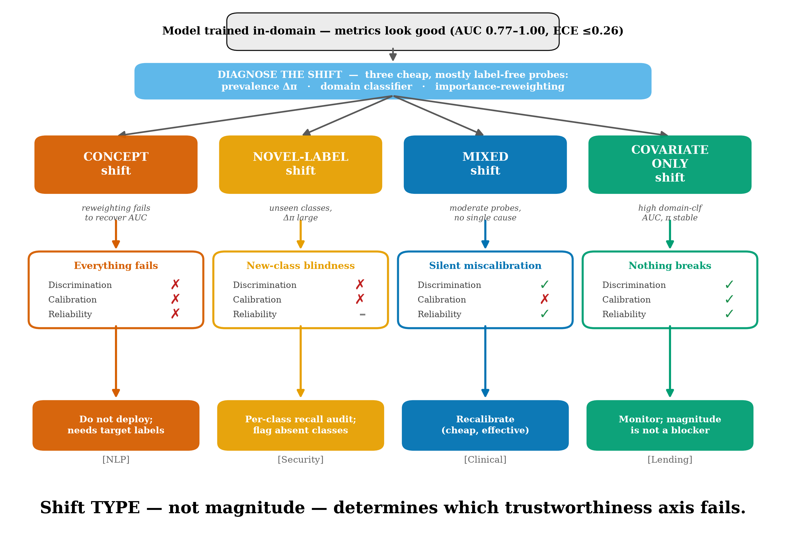

# TrustShift

**Shift type, not shift magnitude, determines machine-learning failure modes under deployment shift.**

TrustShift is a single, pre-registered audit protocol that measures three axes of model
trustworthiness — **discrimination, calibration, and subgroup reliability** — before and after a
distribution shift, assigns each shift a mechanistic **diagnosis** (concept / novel-label /
covariate), and quantifies what a cheap remediation restores. Applied identically to four
deliberately dissimilar domains, it yields a **failure taxonomy**: the *type* of shift predicts
which trustworthiness axis fails, while the *magnitude* of shift does not.



## The four deployment shifts

| Domain | Source → Target | Diagnosis | What fails |
|---|---|---|---|
| Mental-health NLP | Kaggle → Reddit / Twitter | concept | everything (AUC ↓0.28–0.39, calibration, subgroup gap) |
| Network intrusion | CIC-DDoS2019 → CICIDS2017 | novel-label | discrimination + calibration on unseen attack families (AUC 1.00 → 0.64) |
| Clinical risk | NHANES → BRFSS | mixed | calibration only, silently (AUC holds, ECE 0.17 → 0.28) |
| Mortgage lending | HMDA 2020–21 → 2022–24, cross-state | covariate | nothing (robust even at large measured shift) |

**Headline:** a lending model under large measured covariate shift (domain-classifier AUC up to
0.80) degrades on no axis, while a text model at comparable magnitudes loses up to 0.39 AUC.
In-domain metrics predicted none of these outcomes; three cheap, largely label-free probes recover
the shift type in advance.

## Reproduce every number

Every figure and table in the paper regenerates from committed prediction files — no raw third-party
data required.

```bash
python -m venv venv
venv\Scripts\pip install -e .            # installs the package + deps
# audit engine, diagnosis, remediation, meta-analysis, then tables + figures
venv\Scripts\python -m audit.engine
venv\Scripts\python -m audit.diagnosis
venv\Scripts\python -m audit.remediation
venv\Scripts\python -m synthesis.meta
venv\Scripts\python -m synthesis.tables
venv\Scripts\python -m synthesis.figures
venv\Scripts\python -m synthesis.fig_taxonomy
```

Results land in `results/` (audit/diagnosis/remediation/meta JSONs, `tables/*.csv`,
`figures/*.png`). The manuscript sources are in `paper/`.

## Layout

```
config.py            single source of paths + constants
schema.py            standardized prediction schema + validator
domains/             one adapter per domain (clinical, nlp, lending, security)
audit/               engine.py (5 axes), diagnosis.py (shift type), remediation.py
synthesis/           tables.py, figures.py, meta.py (cross-domain regressions)
results/             committed JSONs, tables, and 300-dpi figures (source of every paper number)
paper/               main.tex, references.bib, numbers.py (numbers ↔ results check)
tests/               schema + engine unit tests
```

The four source datasets are public (NHANES, BRFSS, HMDA, GoEmotions, CIC-DDoS2019, CICIDS2017).
Consistent with their licenses, this repository redistributes standardized model **predictions and
metadata**, not raw third-party records.

## Status

Research code accompanying the TrustShift manuscript (under review). The prediction parquets that
constitute the benchmark are hosted separately on the Hugging Face Hub.

## Author

Rajveer Singh Pall.

## License

MIT (code). Source datasets retain their original licenses.
