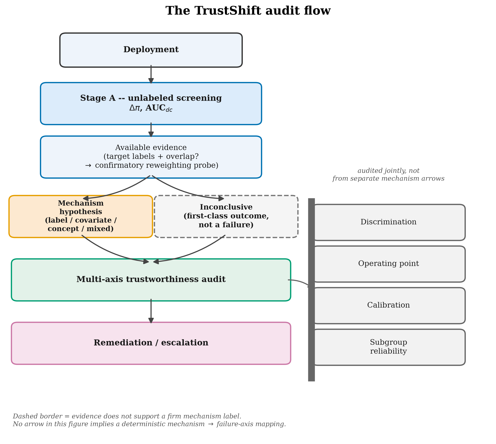

# TrustShift
[](https://doi.org/10.5281/zenodo.21739501)

**A mechanism-aware audit of machine-learning deployment shift.**

TrustShift is a single audit protocol that measures four axes of model trustworthiness —
**discrimination, calibration, operating-point performance, and subgroup reliability** — before and
after a distribution shift, attempts a staged, largely label-free mechanistic **diagnosis** of the
shift (label / covariate / concept / mixed), and reports **inconclusive** honestly when the evidence
does not support a firm label. Applied identically to four deliberately dissimilar domains, it shows
that **scalar shift magnitude alone does not consistently explain which trustworthiness axis fails**;
whether shift *mechanism* specifically carries more information than magnitude is tested directly and
not established by the current evidence.



## The four deployment shifts

| Domain | Source → Target | Diagnosis | What fails |
|---|---|---|---|
| Mental-health NLP | Kaggle → Reddit / Twitter | mixed | everything (AUC ↓0.28–0.39, calibration, subgroup gap) |
| Network intrusion | CIC-DDoS2019 → CICIDS2017 | inconclusive | discrimination + calibration on unseen attack families (AUC 0.998 → 0.684) |
| Clinical risk | NHANES → BRFSS | inconclusive | calibration + operating point far more than discrimination (AUC ≈flat, ECE 0.17 → 0.28) |
| Mortgage lending (temporal) | HMDA 2020–21 → 2022–24 | covariate | none of the four measured axes; ranking improves, operating point flat |
| Mortgage lending (geographic) | HMDA, 60% states → held-out states | inconclusive | operating point degrades (macro-F1 −0.03) while ranking still improves |

**Headline:** a lending model under large measured covariate shift (domain-classifier AUC up to
0.80) improves in ranking while its macro-averaged operating-point performance stays essentially
flat — even though positive-class F1 alone falls 0.06–0.08 — a case where which single metric you
report changes the story. A text model at comparable domain-classifier magnitudes collapses on
every axis. Scalar shift magnitude did not predict which of these would happen; three of the five
targets above are diagnosed **inconclusive** by the current label-free/labeled probes, reported
honestly rather than forced into a category.

## Reproduce every number

Every figure and table in the paper regenerates from committed prediction files — no raw
third-party data required. Regenerating from the raw source repos (clinical, NLP) additionally
needs the sibling repos on `PYTHONPATH`; see [Configuration](#configuration) below.

```bash
python -m venv venv
venv\Scripts\pip install -e .            # installs the package + deps
venv\Scripts\python -m audit.engine      # writes results/audit_{domain}.json
venv\Scripts\python -m synthesis.tables
venv\Scripts\python -m synthesis.figures # includes the Figure 1 audit-flow diagram
```

Results land in `results/` (audit/diagnosis/remediation/meta JSONs, `tables/*.csv`,
`figures/*.png`+`.pdf`). The manuscript sources are in `paper/`.

## Configuration

All paths and constants live in `config.py`. The clinical/NLP source-repo paths and the security
notebook path are only needed to *regenerate* predictions from raw source repos (most users won't
need them — the released, committed predictions in `results/` and on the Hugging Face Hub are
sufficient to reproduce every paper number). Each defaults to this project's own development
machine layout and can be overridden with an environment variable without editing code:

```bash
export TRUSTSHIFT_CLINICAL_REPO=/path/to/diabetes_prediction_project/federated
export TRUSTSHIFT_NLP_REPO=/path/to/mental-health-fairness-nlp
export TRUSTSHIFT_HMDA_FEATURES=/path/to/features_panel.parquet
export TRUSTSHIFT_HMDA_FEATURE_SETS=/path/to/feature_sets.json
export TRUSTSHIFT_DDOS_NOTEBOOK=/path/to/CrossDataset_DDoS_Colab.ipynb
export TRUSTSHIFT_FAIRSCOPE=/path/to/fairscope
```

## Layout

```
config.py            single source of paths + constants
schema.py            standardized prediction schema + validator
domains/             one adapter per domain (clinical, nlp, lending, security)
audit/               engine.py (trustworthiness axes), diagnosis.py (shift diagnosis), remediation.py
synthesis/           tables.py, figures.py (incl. Figure 1), meta.py (cross-domain regressions)
results/             committed JSONs, tables, and 300-dpi figures (source of every paper number)
paper/               main.tex, references.bib, numbers.py (numbers ↔ results check)
tests/               schema + engine unit tests
```

The source datasets are public (NHANES, BRFSS, HMDA, GoEmotions, CIC-DDoS2019, CICIDS2017).
Consistent with their licenses, this repository redistributes standardized model **predictions and
metadata**, not raw third-party records.

## What this benchmark does *not* claim

Per the manuscript's own frozen scientific position: TrustShift does not claim shift mechanism
outpredicts shift magnitude (tested directly, not established by the current evidence — see the
paper's Discussion); it is not a new dataset-shift taxonomy, and not a formal
performance-decomposition estimator. Its contribution is the joint multi-axis audit, the staged
diagnostic protocol that reports `inconclusive` as a first-class outcome, and the remediation
analysis, across four real, non-synthetic cross-modality deployment shifts.

## Status

Research code accompanying the TrustShift manuscript (in preparation). The prediction parquets
that constitute the benchmark are hosted separately on the Hugging Face Hub.

## Author

Rajveer Singh Pall.

## License

MIT (code). Source datasets retain their original licenses.
